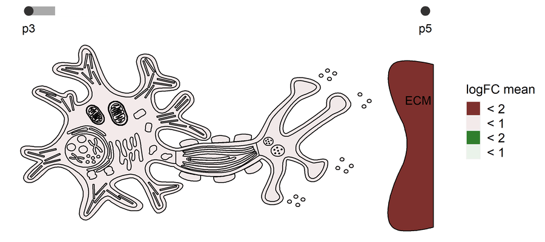

```{r setup, include = FALSE}
knitr::opts_chunk$set(
  collapse = TRUE,
  comment = "#>"
)
```


# Overview

__expressyouRcell__ is a unique and easy-to-use R package which provides an intuitive approach for visualizing and presenting multi-dimensional variations of gene expression levels across time and space. This tool gives the possibility of generating animations of pictographic representations of cells, or pictograms, providing a convenient and intuitive method for visualizing and understanding time course variations in cellular compartments. A range of customizable options is provided to create cellular pictograms starting from users's data.

# Before starting

## Dependencies

* CRAN
	+ data.table (>= 1.13.6),
	+ ggplot2 (>= 3.3.3),
	+ rsvg (>= 2.1),
	+ grImport2 (>= 0.2),
	+ magick (>= 2.5.2),
	+ ggpubr (>= 0.4.0),
	+ RColorBrewer (>= 1.1-2)  
	 
* Bioconductor
	+ IRanges (>= 2.24.1),
	+ org.Mm.eg.db (>= 3.12.0),
	+ clusterProfiler (>= 3.18.0),  
	+ DOSE (>= 3.16.0),	
	+ multtest (>= 2.46.0)
	
## Installation

To install __expressyouRcell__ directly from GitHub, the *devtools* package is required. If not already installed on your system, run:

```{r, eval = FALSE}
install.packages("devtools")
```

Otherwise, load *devtools* and install __expressyouRcell__ by:

```{r, eval = FALSE}
library(devtools)
install_github("https://github.com/gittina/expressyouRcell", dependencies = TRUE)
```

# Loading

To load __expressyouRcell__ run:

```{r eval=TRUE, message=FALSE, warning=FALSE}
library(expressyouRcell)
```

# Prepare input data
__expressyouRcell__ is optimized for representing multiple sets of gene expression data (e.g. multiple stages, different conditions, different tissues). For this reason, the input has to be organized as a list of named *data.tables*. For example, in case of multiple stages, each *data.table* may correspond to a specific time point.

Each *data.table* must have at least a column of gene names named precisely `gene_symbol`. The input table can also contain additional columns with numerical values of gene expression levels (CPM or FPKM) or differential analyses outcomes (such as fold changes and p-values).

# Create the gene-localization table
Before computing the color shade of each region, genes have to be associated with their cellular localization within the cell structure. So, the tool needs a data structure storing information on gene localization within cellular organelles. 

This table can be either provided by the user a or assessed by __expressyouRcell__ through a dedicated function (`map_gene_localization`). In the first option, the user has to provide a data table with two columns: one with gene names (named exactly `gene_symbol`) and one with the associated information of the localization of that gene within the cell (named exactly `subcell_struct`).

However, to ensure a proper functioning of the package workflow we strongly suggest to use the `map_gene_localization` function, provided within __expressyouRcell__. 

This function requires as input the genome annotation file, in GTF format, used during the alignment step. On the complete set of gene symbols extracted from the GTF file, a gene ontology enrichment analysis is performed to associate a gene with a term in the cellular component ontology. For this purpose, only the sub-ontology of the cellular components is taken into consideration. This function generates the gene-localization table, which maps each gene to the locations in the cellular structures, either cellular compartments or macromolecular complexes.

Example of usage with the annotation GTF file:

```{r eval=FALSE}
gene_loc_table <- map_gene_localization(gene_set = "gencode.vM22.primary_assembly.annotation.gtf")
```

```{r include=FALSE}
load("gene_loc_table.RData")
```

Example entries of the resulting `gene_loc_table`:
```{r echo=FALSE, message=FALSE, warning=FALSE}
head(gene_loc_table[subcell_struct=="membrane"])
```


# Choose and color the cellular pictogram

## Visualize pictogram with default colors
The `plot_cell` function allows the user to visualize the chosen cellular map with the default colors, based on the *data.tables* containing the graphical information (coordinates and colors for the cellular organelles). The user can specify the character strings "cell" or "neuron" to choose between a generic cellular pictogram or a neuron pictogram.

```{r eval=TRUE, fig.height=3.5, fig.width=7, message=FALSE, warning=FALSE}
plot_cell(coords_dt = "neuron")
```

## Visualising gene expression data to the cellular pictogram
The main function is called `color_cell` and needs at least three mandatory input parameters.

* A list of *data.tables*, each corresponding to a time point and must have at least a column named `external_gene_name` with gene symbols.
* A *data.table* containing `x` and `y` coordinates, name of the subcellular structures and an associated default color.
* A *data.table* storing for each gene the mapping to a subcellular localization according to the cellular component gene ontology. 

Different methods for assigning colors to subcellular localizations can be chosen through the `coloring_method` parameter. 

### Mean (or median) of values
If `coloring_method` is equal to `mean` or `median`,  genes are first grouped according to their localization, then, mean (or median) of numeric values associated with each gene is computed for each group. In this case, the *data.tables*  in the input list must also have an additional column containing numeric values (e.g. logFC, CPM values, etc.). To specify the value column on which you want to base your coloring, an additional parameter with the name of the column (`col_name`) must be provided as input. The given name must be compatible with column names in the *data.tables* of the input list. 

__expressyouRcell__ can handle the output in two main different manners, according to a potential classification of the genes (e.g. “down-regulated” and “up-regulated” in case of differential analysis). 
This can be achieved with different combinations of the optional parameters `group_by` and `grouping_vars` in the `color_cell` function.

#### 1) Generate a single pictogram for all the genes 
If the `group_by` parameter is set to its default null value, no grouping by classification value is performed, and genes are visualized together on a single cellular pictogram. 

```{r, eval=TRUE, fig.height=3.5, fig.width=8, message=FALSE, warning=FALSE}
example_list_output_together <- color_cell(timepoint_list = example_list,
                                           plot_data = "neuron",
                                           gene_loc_table = gene_loc_table,
                                           coloring_mode = "mean",
                                           col_name = "logFC")
```

When also the `grouping_vars` parameter is set to its null default value, no subselection of categorical value is performed and all genes are selected for the creation of a single cellular pictogram.

If genes have been previously classified into distinct groups according to categorical variables (e.g. “down-regulated” and “up-regulated”), the `grouping_vars` parameter can be used to include only some specific categories of genes for the creation of a single cellular pictogram.

#### 2) Generate multiple pictograms, one for each group of genes
If the `group_by` parameter is set to a non-null value, __expressyouRcell__ separates genes into subsets and outputs multiple `ggplot` objects, one for each category (e.g. either "invariant", up-" or "down-regulated" genes). 
To select this analysis, the user must specify as the `group_by` parameter the name of a column with the categorical variable (e.g. “class”) on which the user has previously stored the gene classification. 

```{r, eval=TRUE, fig.height=3.5, fig.width=8, message=FALSE, warning=FALSE}
example_list_output <- color_cell(timepoint_list = example_list,
                                  plot_data = "neuron",
                                  gene_loc_table = gene_loc_table,
                                  coloring_mode = "mean",
                                  group_by = "class",
                                  col_name = "logFC")
```

The additional parameter `grouping_vars` can be specified to subselect genes associated only to a subset of specified categories (e.g. in case of DEGs classification, “up” and “down”). For instance, when the logFC values are used for defining the color shade of the cellular regions and organelles, it may be desirable to include only differentially expressed genes with the `grouping_vars`. As displayed in the example below, the `grouping_vars` parameter takes as input a list with a named character vector. The vector name must match the `group_by` parameter, and the vector items (e.g. classes "+" and "-") must be present in the `timepoint_list` *data.tables* columns named as `group_by`.


```{r, eval=TRUE, fig.height=3.5, fig.width=8, message=FALSE, warning=FALSE}
example_list_output <- color_cell(timepoint_list = example_list,
                                  plot_data = "neuron",
                                  gene_loc_table = gene_loc_table,
                                  coloring_mode = "mean",
                                  group_by = "class",
                                  grouping_vars = list("class"=c("+","-")),
                                  col_name = "logFC",
                                  colors = list("+" = c("#eaf3ea", "#307e2d"),
                                                "-" = c("#f3eaea", "#7e302d")))
```

If  data have not been previously organized into distinct classes of genes, __expressyouRcell__ can perform this step. To do so, the user has to provide the tool with some additional parameters, such as the cutoff values for the identification of significant differentially expressed genes:

* `thr` to specify the cutoff value to be applied on the `col_name` column,
* `pval_col` to specify the column containing the statistical significance values,
* `pval_thr` to specify the cutoff value  to be applied on the `pval_col` column.

# Print and save your results 

The main function `color_cell` finally returns a list containing four items:

* `localization_values`: a *data.table* with six columns, reporting respectively the subcellular structure with its name, the numeric value computed during the colour assignment step, a numeric code for grouping the cellular localizations by colour with their associated colour shades, and the identifier of each dataset in the user's input data list.
* `ranges`: a *data.table* summarizing the necessary information (e.g. start, end, color and labels) for each range into which subcellular localization values have been assigned. 
* `plot`: a list of `ggplot` objects with the resulting cellular pictograms, coloured accordingly to the user's input data.
* `final_dt`: the  *data.table* with the coordinates and colors for all the organelles which is used by `ggplot` to create the cellular pictograms.

So, static cellular pictograms can be printed by accessing the `plot` item stored within the final list returned by the `color_cell` function.

```{r, eval=TRUE, fig.height=3, fig.width=8, message=FALSE, warning=FALSE}
example_list_output_together[["plot"]][["brain_p3_rs"]]
```

# Dynamic cellular pictogram creation 

expressyouRcell allows to generate dynamic representations of cellular pictograms to visualize changes across time. This is particularly useful when the user’s input data consists of multiple sets of gene expression data (e.g. multiple stages).
In this step, the data structure obtained from the `color_cell` function is required as input to the function which creates a short movie or an animated picture. This function requires as input a list with time point labels, the transition duration (in seconds), and the number of frames to be created for each transition between time points. The user can also specify additional parameters, such as the animation sizes, the output directory and filename. A vector of labels is required as input to create the timeline. For each transition, the function creates a set of temporary frames with intermediate color shades which will then be merged together in a single animated picture or short movie. The `gifski` and `av` packages are respectively used to produce the gif picture or the movie. 

```{r eval=FALSE, fig.height=3, fig.width=8, message=FALSE, warning=FALSE, include=TRUE}
animate(data = example_list_output,
        timepoints = c("brain_p3_rs-", "brain_p5_rs-"),
        seconds = 3, fps = 5,
        input_dir = getwd(), height = 400, width = 900,
        filename = "brainp35",
        names = c("p3", "p5"),
        format = "gif")
```


```{r, out.width = '690px', fig.retina = NULL, echo = FALSE}

```
